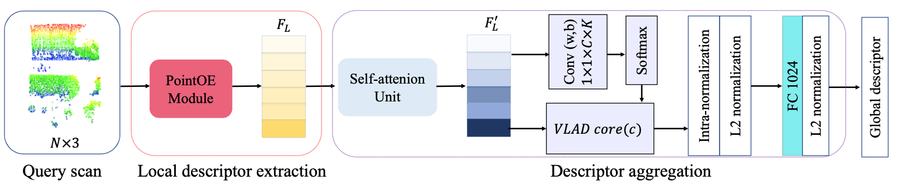

# SOE-Net: A Self-Attention and Orientation Encoding Network for Point Cloud based Place Recognition (CVPR 2021 Oral) 

This repository is the official implementation for paper: 

SOE-Net: A Self-Attention and Orientation Encoding Network for Point Cloud based Place Recognition

[Yan Xia](https://scholar.google.com.hk/citations?user=xkBn4mMAAAAJ&hl=en), [Yusheng Xu,](https://scholar.google.com.hk/citations?user=U1xaKegAAAAJ&hl=en) [Shuang Li](https://scholar.google.com/citations?user=VXCiAc4AAAAJ&hl=en), [Rui Wang](https://scholar.google.com.hk/citations?user=buN3yw8AAAAJ&hl=en), [Juan Du](), [Daniel Cremers](https://scholar.google.com.hk/citations?user=cXQciMEAAAAJ&hl=en), [Uwe Stilla](https://scholar.google.com.hk/citations?user=M3beNHEAAAAJ&hl=en)

Technical University of Munich, Beijing Insitute of Technology, Artisense

#### Introduction

------

SOE-Net fully explores the relationship between points and incorporates long-range context into point-wise local descriptors. Local information of each point from eight orientations is captured in a PointOE module, whereas long-range feature dependencies among local descriptors are captured with a self-attention unit. Moreover, we propose a novel loss function called Hard Positive Hard Negative quadruplet loss (HPHN quadruplet), that achieves better performance than the commonly used lazy quadruplet loss.



#### Pre-requisites

------

- Python3.6
- Tensorflow1.4.0
- CUDA-9.0
- Scipy
- Pandas
- Sklearn
- The TF operators under tf_ops folder should be compiled.
- generate pickle files, refer to [PointNetVLAD](https://github.com/mikacuy/pointnetvlad).

#### Training

------

```python
python train.py
```

#### Evaluation

------

```python
python evaluate.py
```

#### Pretrained models

------

The pre-trained models for both the baseline and refinement networks can be downloaded [here](https://drive.google.com/drive/folders/1D8w0exzX0nH18lgx7w2Mv4ghBpTD5lYJ?usp=sharing).

#### Acknowledgement

------

The code is in heavily built on [PointNetVLAD](https://github.com/mikacuy/pointnetvlad). We also borrow something from [PointSIFT](https://github.com/MVIG-SJTU/pointSIFT).

#### Citation

------

If you find our work useful in your research, please consider citing:

```
@inproceedings{xia2021soe,
 author = {Y. Xia and Y. Xu and S. Li and R. Wang and J. Du and D. Cremers and U. Stilla},
 title = {SOE-Net: A Self-Attention and Orientation Encoding Network for Point Cloud based Place Recognition},
 booktitle = {IEEE Conference on Computer Vision and Pattern Recognition (CVPR)},
 year = {2021},
 award = {Oral Presentation},
}
```


